# Prior Authorization Copilot Architecture

## Executive summary

The system is a bounded, human-in-the-loop prior-authorization workflow:

> The model reads and cites evidence. Deterministic code evaluates policy predicates. A human owns the final decision.

The model never returns an approval or denial. The automated path has only two outcomes: `provisional_affirmation` and `refer_to_human`.

## End-to-end pipeline

```mermaid
flowchart LR
    A[Provider uploads PA request and patient charts] --> B[FastAPI intake]
    B --> C[Persist job and validate files]
    C --> D[OCR documents\nLLM: transcription only]
    D --> E[Typed OCR transcript]
    E --> F[Clinical extraction\nLLM: facts and evidence spans]
    F --> G[Structured extraction result]
    G --> H[Route request\nDeterministic code]
    H --> I[Locate evidence for each clause\nLLM: evidence matching only]
    I --> J[Criterion evidence]
    J --> K[Evaluate predicates\nDeterministic code]
    K --> L[Criteria matrix\nmet / not_met / unknown]
    L --> M[Decide\nDeterministic code]
    M --> N{Outcome}
    N --> O[Provisional affirmation\nall required criteria met]
    N --> P[Refer to human\nanything missing, uncertain, unsupported, or failing]
    O --> Q[Reviewer review and final decision]
    P --> Q
    Q --> R[Persist reviewer agreement, override, or final outcome]
```



## Responsibility boundaries

| Stage | Owner | Input | Output | Can produce an outcome? |
|---|---|---|---|---|
| Intake | FastAPI/application code | Uploaded PNG, JPEG, WebP, or PDF | Validated job and stored files | No |
| OCR | LLM through provider interface | Source documents | Typed transcript with document/page references | No |
| Clinical extraction | LLM through provider interface | Typed OCR transcript | Facts with values, confidence, and evidence text | No |
| Routing | Deterministic registry | Extracted plan and procedure | Policy, pathway, and criteria-set route | No |
| Evidence location | LLM through provider interface | Facts, transcript, and policy clauses | Criterion-level patient evidence | No |
| Predicate evaluation | Deterministic evaluator | Criterion predicates and evidence | `met`, `not_met`, or `unknown` per criterion | No individual coverage outcome |
| Decision | Pure deterministic function | Complete criteria matrix | Provisional affirmation or human referral | Yes, but no denial exists in the type |
| Final review | Human reviewer | Matrix, citations, and referral reasons | Recorded reviewer decision | Yes |

## Data contracts between stages

### 1. OCR result

Each document produces an `OcrDocument` containing:

- document identifier and original filename;
- transcript blocks and page number;
- literal text;
- legibility/confidence signal;
- uncertainty alternatives where applicable.

The extraction stage consumes this saved OCR result. It does not silently bypass the transcript.

### 2. Structured extraction

Each extracted entity contains:

- field name and display name;
- literal and normalized value;
- data type and unit;
- confidence and verification status;
- exact evidence text;
- source document identifier.

Evidence is checked against the OCR transcript. Unsupported values are downgraded for review rather than promoted into the decision layer.

### 3. Versioned policy registry

The policy is stored as structured, reviewed data. Each criterion contains:

- stable criterion ID;
- verbatim policy clause;
- source page;
- predicate type and parameters;
- policy ID and effective date.

Example:

```yaml
id: MGB-008.TORe.5
page: 4
text: "The primary surgery was performed at least one year ago"
predicate:
  type: temporal
  anchor: primary_surgery_date
  op: ">="
  duration: P1Y
  relative_to: order_date
```

The evaluator does not interpret free-form policy prose at runtime. It evaluates the reviewed predicate representation.

### 4. Criteria matrix

Every governing criterion receives exactly one status:

- `met`: evidence satisfies the predicate;
- `not_met`: evidence is present and contradicts the predicate;
- `unknown`: evidence is missing, ambiguous, unsupported, delegated, or not traceable.

`unknown` is not converted into `not_met`. It always contributes to human referral.

## Decision boundary

```text
All required criteria = MET
and every result has traceable patient evidence
and the route is supported
        |
        +--> PROVISIONAL AFFIRMATION

Anything else
        |
        +--> REFER TO HUMAN
```

There is no automated `denied` value. A denial can only be recorded through the separate reviewer-decision workflow by a human reviewer.

## What the demo proves

### Case 1: complete TORe packet

Input:

- Commercial line of business;
- Transoral outlet reduction (TORe);
- PA request, clinical summary, and surgical history images.

Pipeline result:

- route: `MGB-008` / `TORe`;
- criteria evaluated: 16;
- criteria met: 16/16;
- outcome: `provisional_affirmation`.

### Case 2: out-of-domain packet

Input:

- Synthetic documents unrelated to the bariatric policy pathway.

Pipeline result:

- no applicable bariatric route;
- no unrelated policy is forced onto the packet;
- outcome: `refer_to_human`;
- referral reason explains that there is no applicable guideline and no coverage determination is made.

This case demonstrates conservative routing, not a policy failure.

## Persistence and observability

The application persists:

- uploaded document metadata;
- OCR result;
- structured extraction;
- criteria matrix and adjudication;
- ordered workflow events;
- reviewer corrections and decisions.

The browser receives an event stream showing bounded tool calls and results. The persisted job remains the source of truth, so a completed job can be reopened through its `?job=<id>` URL.

## Safety and limitations

- Missing or ambiguous evidence routes to a human.
- Model output is schema-validated and evidence-linked.
- Policy clauses retain source pages and effective dates.
- Confidence is a review-prioritization signal, not a calibrated probability.
- The current corpus is synthetic and small.
- The prototype does not provide authentication, PHI controls, production audit retention, or a durable job queue.
- Production activation requires payer and clinical review of every policy predicate.

## Suggested attachment filename

`Shreyas_Prior_Authorization_Copilot_Architecture.pdf`

Export this document to PDF before sending it with the video. Also include the repository link so the recipient can inspect the implementation and the longer technical design.

## Demo video

https://www.youtube.com/watch?v=QrXxezvchZM
